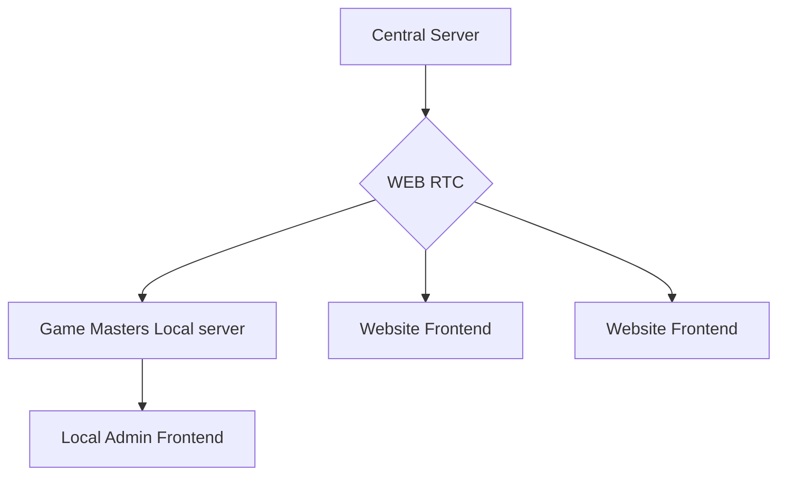

Add new functionality to this Backend.

Overall Functionality Description:
We are changing architecture from Frontend<->Backend server 

To P2P Web RTC connection with main server authentication and signaling.

Components: 
- Normal user Frontend (Website)
- Admin Frontend (Local GM Server)
- Central Auth and Connection Server
- GameMaster Local Server Backend.
- WEBRTC for P2P Connection 

This document is for frontends, for backend changes see MigrationWEBRTC_Backend.md

Part 1 - Splitting GM Frontend and Player Frontend
- Create Env variable to determine if the server is running in GM mode or Player mode. This will help us to conditionally load different configurations and services based on the mode.

- Split logic in future based on this variable, for example:
    - In GM mode, load the admin dashboard, game management tools, and other GM specific features.
    - In Player mode, load the player dashboard, game joining features, and other player specific functionalities.

- This will allow us to have a single codebase for both GM and Player frontends while still maintaining separation of concerns and ensuring that each mode has access to the features it needs without unnecessary bloat from the other mode.

Part 2 - Auth endpoints
    - Add WebHelper methods to handle JWT authentication with central server.
    - Implement logic to obtain and store JWT tokens for both GM and Player modes.
    - Create a service to manage user sessions and token refresh for both modes.
    - Create methods to check if server is authenticated. This will be used to conditionally render components based on authentication status and to ensure that API calls are made with valid tokens.

Part 3 - WebRTC Implementation.
- Implement WebRTC connection establishment between GM Local Server and Central Server for signaling. This will involve creating a WebRTC service that can handle the connection setup, including exchanging offer/answer and ICE candidates with the central server. Please check if WebSocketManager can be used for signaling or if a separate signaling mechanism is needed.
- Implement functionality to handle incoming WebRTC connections from the central server and establish P2P connections with the website frontends. This will involve handling signaling messages, ICE candidates, and managing peer connections. The WebRTC service should be able to manage multiple peer connections for different players and GMs.
- Adapt WebSocketManager to handle WebRTC signaling messages and manage peer connections. This may involve creating new message types for signaling and updating the connection management logic to support WebRTC connections. Ensure that the WebSocketManager can differentiate between regular WebSocket messages and WebRTC signaling messages, and route them appropriately to the WebRTC service for handling.

Part 4 - UI/UX Adjustments - new features
 - Update the UI to reflect the new architecture and features. This may involve adding new components for managing WebRTC connections, displaying connection status, and providing feedback to users about their connection state.
 
 For User Frontend:
    - Add UI components to display connection status with the central server and other players.
    - Instead of GameList Component (This one is for gm local server), add a component to display available game sessions that the player can join, which will be fetched from the central server.
    - Do not show Application settings nor Users management here

For GM Local Server Frontend:
    - Add UI components to manage WebRTC connections with the central server and players. This may include a dashboard to view active connections, manage game sessions, and monitor player activity.
    - Update the game management UI to reflect the new architecture, Games on are becoming sessions that players can join, so we need to adjust the UI to reflect this change. This may involve changing the way games are displayed and how GMs can manage them.
    - Show Application settings and Users management here, but remove create user and reset password options since these will now be handled through the central server. allow to kick and ban users for your games. Altough this functionality is not yet implemented in backend, we can prepare the UI for it.
    - Prepare configuration in .env files and UI for WebRTC connection settings, such as STUN/TURN server configuration, connection timeouts, etc. This will allow GMs to customize their WebRTC connection settings based on their network environment and requirements.
    - Add UI components to display connection status with the central server and connected players, allowing GMs to monitor the health of their connections and take action if needed.