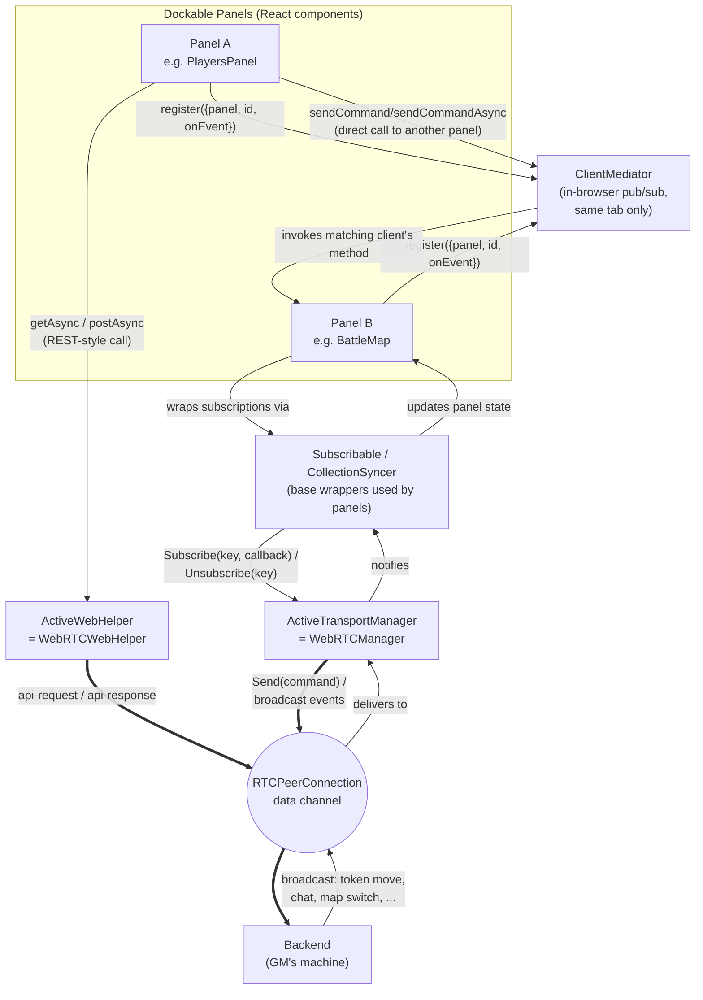
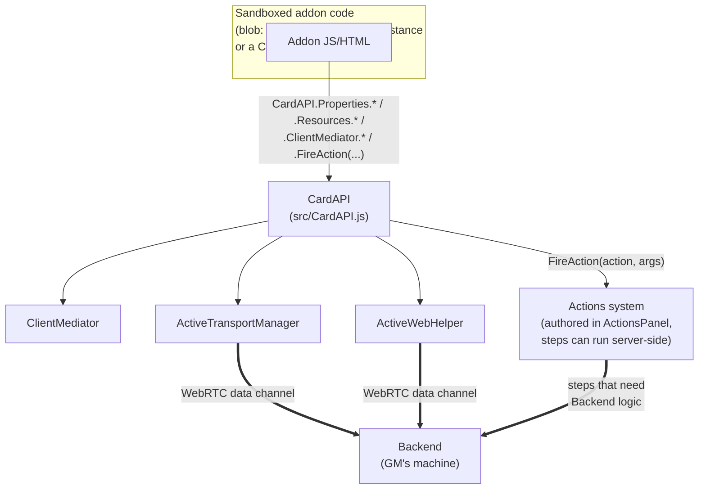

# Overview

This is frontend part of NordvikManager application. if you are looking for release check [Nordvik Manager Repository](https://github.com/haffff/NordvikManager).

Nordvik Manager frontend is SPA application written in React. Whole idea of application is wrapped around modified [ReactDockable made by Hlorenzi](https://github.com/hlorenzi/react-dockable). Forked version by me you can find [here](https://github.com/haffff/react-dockable-expanded).

## Setting up enviroment for development

In the project directory, you can run standard Vite commands via pnpm. You need a few env variables — see `.env.example` (a working dev default is already committed as `.env`).

### Env variables

All custom env vars must be prefixed `REACT_APP_` (a holdover from the app's Create React App days — Vite is configured to still honor this prefix).

- `REACT_APP_BASE_URL` — host of the backend you want to use, without protocol (mind the CORS!). Leave empty if running from a backend-served build.
- `REACT_APP_PROTOCOL` — `"http://"` or `"https://"`. Leave empty for a backend-served build.
- `REACT_APP_CENTRAL_URL` — URL of the [Central server](https://github.com/haffff/NordvikManager-Central) used for login and WebRTC signaling. Point at a local instance for dev, or `nordvikmanager.pl` for production auth.
- `REACT_APP_MODE` — `"gm"` or `"player"`. Usually left unset in favor of the `start_gm`/`start_player` scripts below.
- `REACT_APP_STUN_SERVER` — optional; defaults to `stun:stun.l.google.com:19302`.

### Start of development server

`pnpm install` then one of:

- `pnpm start` — dev server, mode taken from `REACT_APP_MODE` if set
- `pnpm start_gm` — dev server pinned to GM mode, port 3002
- `pnpm start_player` — dev server pinned to Player mode, port 3001
- `pnpm build` — production build (`pnpm run buildci_gm` / `buildci_player` for role-specific CI builds)
- `pnpm test` — Vitest

To run this alongside Central and the Backend in one command instead of juggling three terminals, use `pnpm run dev` from the [main repo](https://github.com/haffff/NordvikManager#development-setup) — it starts Central, both frontend roles, and the Backend together.

## Architecture

Frontend is a single React SPA that serves **both** the GM and the Player role (`REACT_APP_MODE`), built around React Dockable. One tab in dockable contains a "Panel" — there are several panel types like "Players Panel", "Materials Panel" or "BattleMap". Panels have 3 options to communicate with other places in the application: commands via [ClientMediator](src/ClientMediator.js), REST calls via [ActiveWebHelper](src/helpers/transport.js), and real-time game events via [ActiveTransportManager](src/helpers/transport.js) (wrapped with [Subscribable](src/components/uiComponents/base/Subscribable.js) or [CollectionSyncer](src/components/uiComponents/base/CollectionSyncer.js)). ClientMediator is used purely for in-browser communication between modules; it doesn't leave the client.

There is no direct HTTP connection from the browser to the game backend. Instead, the browser and the GM's [Backend](https://github.com/haffff/NordvikManager-Backend) each connect out to the [Central server](https://github.com/haffff/NordvikManager-Central) to exchange WebRTC signaling (via Socket.IO), then establish a direct peer-to-peer `RTCPeerConnection` data channel. All in-game REST calls and broadcast commands (token updates, map switching, chat, etc.) are tunneled over that one data channel. See the [system-level diagram and handshake sequence](https://github.com/haffff/NordvikManager#architecture) in the main repo for the full picture across all three components.

`src/helpers/transport.js` is the canonical import for in-game communication — it re-exports `ActiveWebHelper` and `ActiveTransportManager`, both backed by the WebRTC implementations described below. Always import from `transport.js` in components; never import `WebRTCWebHelper` / `WebRTCManager` directly.

### ClientMediator

ClientMediator has 3 types of methods. 
- First type contains of Send, SendAsync, SendAndWaitForRegister, and SendAndWaitForRegisterAsync.
- Second type are Register and Unregister methods. In additon there are hooks related to that is [useClientMediator](src/components/uiComponents/hooks/useClientMediator.js) hook.
Register method registers provided object with commands to commands index. Requirement for that object is to contain 2 fields: Panel and Id. In addition optional method onEvent that triggers on any event broadcasted.

### WebRTC transport and wrappers

- [WebRTCWebHelper](src/helpers/WebRTCWebHelper.js) — REST-over-WebRTC. Mirrors the old `WebHelper`'s API (`get`, `post`, `getAsync`, `postAsync`, `deleteAsync`, ...) but tunnels every request through the data channel as an `api-request` message; the GM's Backend proxies it to its own HTTP pipeline and sends back `api-response`. Requests are queued until the channel opens.
- [WebRTCManager](src/components/game/WebRTCManager.js) — the actual WebRTC transport (Socket.IO signaling → `RTCPeerConnection` + data channel → offer/answer/ICE → channel open). Mirrors the API of the old raw-WebSocket manager it replaced (`Subscribe`/`Unsubscribe`/`Send`, `WebSocketReady` flag), which is why it's still exposed under the `WebSocketManagerInstance` alias in a couple of hooks (e.g. `useWebSocketConnection`) — there is no raw WebSocket connection anymore, only this WebRTC one.
- [Subscribable](src/components/uiComponents/base/Subscribable.js) and [CollectionSyncer](src/components/uiComponents/base/CollectionSyncer.js) — wrapper components heavily used in panels to watch over real-time game commands arriving over the transport above.
- [CentralWebHelper](src/helpers/CentralWebHelper.js) — plain fetch-based client for the Central server (login, token refresh, session listing) — not used for game data.
- [WebHelper](src/helpers/WebHelper.js) — the original fetch-based REST client. Now used only for direct-HTTP cases that don't go through the game session, e.g. resource/image URLs (`getResourceString`) and serving the app itself from the Backend's `wwwroot` build.

### Where does my code go? ClientMediator vs. WebRTC transport

The two channels solve different problems and are not interchangeable:

- **ClientMediator** — same-browser-tab only. Use it when one panel needs to call into or hear from another panel/module without going anywhere near the network (e.g. the toolbar telling BattleMap to switch tools). Nothing here ever reaches the Backend.
- **`ActiveTransportManager` / `ActiveWebHelper`** — leaves the browser. Use `ActiveWebHelper` for a one-off REST call (fetch/save data); use `ActiveTransportManager` (usually via `Subscribable`/`CollectionSyncer`) when you need to react to real-time events broadcast by the Backend or other players (token moves, chat, map switches).

`ActiveWebHelper` and `ActiveTransportManager` are two different API surfaces (REST-style vs. pub/sub) but share the *same* underlying `RTCPeerConnection` data channel — `WebRTCManager` owns the connection and `WebRTCWebHelper` is injected into it via `setTransport()`.

### Addon communication

Addon-authored code runs inside a sandboxed `blob:` iframe (`sandbox="allow-scripts"`, null origin) and can *only* talk to the rest of the app through **[CardAPI](src/CardAPI.js)** — call `CardAPI.Properties.*`, `CardAPI.Resources.*`, `CardAPI.ClientMediator.*`, `CardAPI.FireAction(...)`, etc. from inside the sandbox and it takes care of getting the request to the right place (with an allowlist enforced on the host side). A full CardAPI method reference will live on a separate docs site — this README just covers where things fit.

Two trusted host panels create a sandbox like this:
- **`CardPanel`** — a card *instance* created from a Template (see `TemplatesPanel`, where card Templates are authored/managed).
- **`CustomViewsPanel`** — a standalone sandboxed view with no Template behind it, for addon UI that isn't a "card" (just a custom panel).

Sandboxed JS cannot reach the Backend on its own — for addon logic that needs Frontend↔Backend communication beyond what CardAPI exposes, define an **Action** (authored/edited in `ActionsPanel`) and trigger it from the sandbox via `CardAPI.FireAction(action, args)`; Action steps can run server-side.

`LookupPanel` and `EventLogPanel` are developer-facing debug/log tooling, not an addon extension point.

